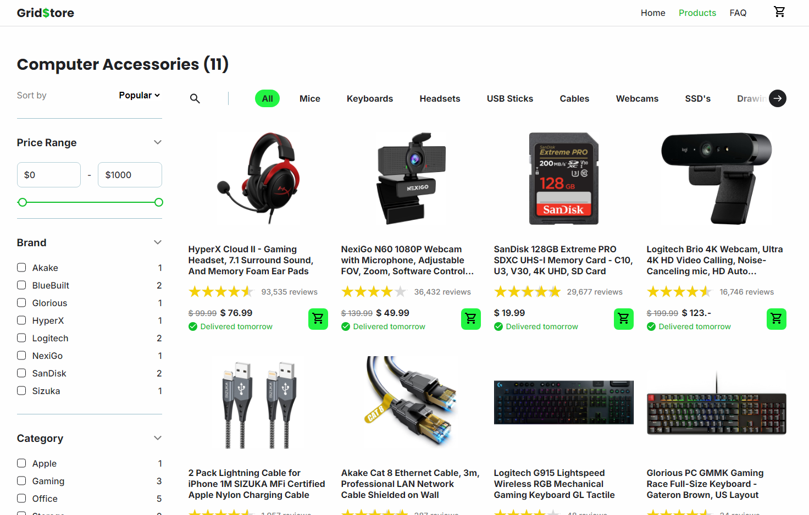

# Javascript Exercise Webstore 🤯

In this exercise, it's your task to make the webshop interactive. Aka: make the filters work and the products show up.
Now, I'll admit, this is not the easiest. So don't be worried if some things don't work.

This is also actually something you would most likely do in a framework like React, but sadly enough you'll have to wait until year 3
to learn that in school. Thus, we're gonna do it the long and imperative way.

I've split this exercise into different levels based on what I think is easier and harder. See how far you can get!

Tip: sometimes things seem really big and complex. Write down the logic with comments first. Start small, don't overdo it. Build up slowly.


<br/>
<br/>

## |--- LEVEL 0: FAMILIARIZE ---|

### Step 1: Look at the working version

Open the HTML file in the solution folder in your browser and take a look. This is ideally how everything should work.
Try clicking on the different filters and so on.

Keep in mind not everything is implemented (only in stock, closing filter windows ...)


### Step 2: Learn the HTML structure

Open the exercise HTML file in your IDE (VS Code, IntelliJ ...).
Take a look at the structure. You don't have to understand everything, but I've written comments near the important parts.
Familiarize yourself a little bit. A good understanding of the structure goes a long way.

**You will not have to edit the HTML or CSS files. Only the .js files in the js folder**


### Step 3: Learn the Javascript structure

Take a look at the Javascript in the exercise folder. I used an OOP approach and gave you some templates to start.
If you want to do a completely different approach feel free. Anything is allowed.


<br/>
<br/>

## |--- LEVEL 1: DISPLAY THE PRODUCTS ---|

Currently there's a loader displayed. We don't want that, we want the products.

### Step 1: Product.js destructure product object

After we have received the product objects in main.js, they are being passed to the Product.js class.
It is now your task to turn all those product object properties into attributes of the class.

Check the product.json file to see the structure of one of those objects.
If you're unfamiliar with json, don't worry it's just a regular javascript object.

> hint: this.name = productObj.name

### Step 2: Generate the HTML and store it as the article attribute

Use the attributes we defined in the previous step to make the following HTML structure with pure JS.
(yes it's a lot of work).

There are some helper methods provided in Product.js to format numbers and prices.

```html
<article>

    <figure class="product-image" style="background-image: url(images/bluebuilt-filum.png);"></figure>

    <h3>BlueBuilt Filum Silent Wired Mouse 800 - 1600 dpi</h3>

    <div class="rating">
        <figure class="stars" aria-label="4/5 Stars">
            <div style="width: 80%;"></div>
        </figure>
        <span>12 reviews</span>
    </div>

    <div class="bottom-info">
        <div class="bottom-info-left">
            <div class="price">
                <span class="current-price">$ 23.99</span>
            </div>
            <div class="delivery-info">
                <figure></figure>
                <span>Delivered tomorrow</span>
            </div>
        </div>
        <button>
            
        </button>
    </div>

</article> 
```

> hint: You don't need to save any other attribute in #generateHTML other than this.article. By using article.appendChild() we can build a small DOM tree all stored in this.article. If we want to display that article tree we made, all we gotta do is add it somewhere in the main HTML tree. E.g. document.body.appendChild(product1.article)

### Step 3: Display the products

Finally it's time to display the products!

In our main.js file we have a method called displayProducts(). Simply add all the products in this.originalProducts to this.productsContainer, and boom we can see them!

Remember to call the method somewhere and also hide the loader.
Futhermore, if you dare, also update the span with `id="product-count"`.

> hint: Call the method displayProducts() at the end of startUp() because startUp is async.

### CONGRATS LEBEL 1 COMPLETE!

If you're stuck feel free to ask me for help.


<br/>
<br/>

## |--- LEVEL 2: FILTER BY TYPE ---|

Phew that's done, now things are gonna get more interesting (and maybe a little bit more complex).
For this level we're gonna be editing main.js and FiltersRadio.js.

### Step 1: Add horizontal scroll with buttons functionality to the Type Filters

Edit the #addScroll() and #setScrollButtonDisplay() methods for this one.

#addScroll() moves this.filtersList left or right depending on the button clicked. This requires a little math to figure out how far to move the element.

> Hint1: Use the transform CSS property to move filtersList left or right
> Hint2: Use this.filtersParent.offsetWidth as a basis to figure out how far left or right to move this.filtersList
> hint3: Use an if statement to limit how far left or right this.filtersList is allowed to move

#setScrollButtonDisplay() displays the left or right button depending on the position of this.filtersList.

> Hint4: call #setScrollButtonDisplay() after every click on a button (aka after the position of filtersList has been updated)

### Step 2: checkedValue getter needs to return the value of the currently selected input

Title explains it.

> Hint: if a radio input is selected it is, in CSS terms, checked

> Solution1: `return this.filtersList.querySelector('input:checked').labels[0].textContent.toLowerCase();`
> solution2: `return this.filtersList.querySelector('input:checked').id.split('-')[1]`

### Step 3: Filter time

Okay so we hopefully got a working filter select thingie rn. Now it's time to actually, u know, filter the products.

<br/>
<br/>

## |--- LEVEL 1000 MAFIA BOSS ---|

Make the PriceSlider x.

Make it work, make it filter, all that stuff.

This is pretty much a completely custom component that doesn't really rely on any built-in HTML solutions besides the range input type.
It is therefore a little bit more complex to make work. It doesn't require a lot of code, but might take some thinking.

Sooo if you wanna flex try to build this, but don't be discouraged if you're stuck. My solution is available too.

<br/>
<br/>
<br/>
<br/>

## |--- CORNER FOR PEOPLE THAT ARE STUCK ---|

🙏🙏🙏🙏🙏🙏🙏🙏🙏 shrok 🙏🙏🙏🙏🙏🙏🙏🙏🙏🙏🙏

⠀⠀⠀⠀⠀⠀⠀⠀⠀⠀⠀⠀⠀⠀⠀⠀⠀⠀⠀⠀⠀⠀⠀⠀⠀⠀⠀⣀⣀⠀⠀⠀⣀⠀⠀⠀⠀⠀⠀⠀⠀⠀⠀⠀⠀⠀⠀⠀⠀⠀⠀⠀⠀⠀
⠀⠀⠀⠀⠀⠀⠀⠀⠀⠀⠀⠀⠀⠀⠀⠀⠀⠀⠀⠀⠀⠀⠀⢀⠴⠊⠉⠀⠀⠀⠀⠀⠀⠈⠁⠢⡀⠀⠀⠀⠀⠀⠀⠀⠀⠀⠀⠀⠀⠀⠀⠀⠀⠀
⠀⠀⠀⠀⠀⠀⠀⠀⠀⠀⠀⠀⠀⢀⡀⠀⠀⠀⠀⠀⠀⠀⠔⠁⠀⠀⠀⠀⠀⠀⠀⠀⠀⠀⠀⠀⠈⠢⡀⠀⠀⠀⠀⠀⠀⠀⠀⠀⠀⠀⠀⠀⠀⠀
⠀⠀⠀⠀⠀⠀⠀⠀⠀⠀⠀⠀⠀⠈⠇⠀⠀⠀⠀⠀⠀⠀⢀⣴⣶⣶⣄⡀⠀⠀⠀⠀⠀⠀⠀⠀⠀⠀⠘⡄⠀⠀⠀⠀⠀⠀⠀⠀⠀⠀⠀⠀⠀⠀
⠀⠀⠀⠀⠀⠀⠀⠀⠀⠀⠀⠀⠀⠶⠿⠶⣄⡈⠂⠔⠀⠀⠈⠀⠀⠈⠉⠻⣦⡀⠀⠀⠀⠀⠀⠀⠀⢀⣠⡘⡀⠀⠀⠀⠀⢰⠀⠀⠀⠀⠀⠀⠀⠀
⠀⠀⠀⠀⠀⠀⠀⠀⠀⠀⠀⠀⠀⠀⠀⠀⠀⠙⡆⠀⠀⠀⠀⠒⣉⣉⠛⢿⣿⣿⣄⠀⢀⣠⣤⣶⡾⠛⠋⠙⠁⣀⠔⠁⣠⣬⡀⠀⠀⠀⠀⠀⠀⠀
⠀⠀⠀⠀⠀⠀⠀⠀⠀⠀⠀⠀⠀⠀⠀⠀⠀⢀⠇⠀⠀⠀⠐⠁⢞⣯⠎⣸⠿⠛⠉⠀⠘⢿⣟⢭⣭⡅⠀⠀⠀⠀⡠⠚⠉⠉⠉⠀⠀⠀⠀⠀⠀⠀
⠀⠀⠀⠀⠀⠀⠀⠀⢀⣤⣀⡀⠀⠀⢀⣠⣤⡞⠀⠀⠀⠀⠀⠀⠀⠀⠀⠀⠀⠀⠀⠀⠀⠈⠓⠜⠻⠃⠀⠀⠀⠰⠀⠀⠀⠀⣠⡄⠀⠀⠀⠀⠀⠀
⠀⠀⠀⠀⢀⣀⣀⣤⣼⣿⣿⣿⣿⣿⣿⣿⡟⠀⠀⠀⠀⣠⣤⣤⣤⣦⣤⣄⠀⠀⠀⠀⠀⠀⠀⠀⠀⠀⠀⠀⠀⠀⢷⣶⣶⣿⣿⣿⡀⠀⠀⠀⠀⠀
⠠⠔⠒⠉⠉⠀⠈⠉⢿⣿⣿⣿⣿⣿⣿⣿⡇⠀⠀⢀⣼⠟⠛⠛⠛⠛⠻⢿⣷⣤⣄⣀⣠⣤⡶⠦⠤⡀⠀⠀⠀⠀⢸⣿⣿⣿⣿⣿⣿⠟⠛⠉⠁⠒
⠀⠀⠀⠀⠀⠀⠀⠀⠈⣿⣿⣿⣿⣿⣿⣿⠀⠀⢀⠞⠀⠀⠀⠀⠀⠀⠀⠀⠈⠛⠛⠛⠉⠁⠀⠀⠀⠈⢳⣆⠀⠀⢸⣿⣿⣿⣿⣿⡇⠀⠀⠀⠀⠀
⠀⠀⠀⠀⠀⠀⠀⠀⠀⣿⣿⣿⣿⣿⣿⣿⠀⠀⠈⠀⠐⣶⣿⣿⠿⣿⠖⢦⣄⣀⣀⡀⠀⠀⠀⠀⠀⠀⠀⠻⠀⠀⢸⣿⣿⣿⣿⣿⡇⠀⠀⠀⠀⠀
⠀⠀⠀⠀⠀⠀⠀⠀⠀⣿⣿⣿⣿⣿⣿⣿⡀⠀⠀⠀⠀⠸⣿⣿⣇⣿⣀⡈⠀⠀⠋⠉⠙⠛⠛⢲⣦⠤⠀⠀⠀⠀⣿⣿⣿⣿⣿⣿⡇⠀⠀⠀⠀⠀
⠀⠀⠀⠀⠀⠀⠀⠀⢰⣿⣿⣿⣿⣿⣿⣿⣇⠀⠀⠀⠀⠀⢻⣿⣿⣿⣿⣿⣿⣿⣷⣶⣾⣶⣿⡿⠃⠀⠀⠀⠀⢰⣿⣿⣿⣿⣿⣿⣧⠀⠀⠀⠀⠀
⠀⠀⠀⠀⠀⠀⠀⠀⢸⣿⣿⣿⣿⣿⣿⣿⣿⡄⠀⠀⠀⠀⠀⠻⣿⣄⡉⠙⠛⠛⠛⠛⢻⡿⠋⠀⠀⠀⠀⠀⢀⣾⣿⣿⣿⣿⣿⣿⣿⠀⠀⠀⠀⠀
⠀⠀⠀⠀⠀⠀⠀⠀⣿⣿⣿⣿⣿⣿⣿⣿⣿⣿⡀⠀⠀⠀⠀⠀⠈⠉⠛⠻⠷⠶⠶⠒⠉⠀⠀⠀⠀⠀⠀⢠⣾⣿⣿⣿⣿⣿⣿⣿⣿⡆⠀⠀⠀⠀
⠀⠀⠀⠀⠀⠀⠀⢰⣿⣿⣿⣿⣿⣿⣿⣿⣿⣿⣷⡄⠀⠀⠀⠀⠀⠀⠀⠀⠀⠀⠀⠀⣀⣤⡀⠀⠀⢀⣴⣿⣿⣿⣿⣿⣿⣿⣿⣿⣿⡇⠀⠀⠀⠀
⠀⠀⠀⠀⠀⠀⠀⣼⣿⣿⣿⣿⣿⣿⣿⣿⣿⣿⣿⣿⣄⠀⠀⠀⠀⠲⣤⣤⣤⣤⣴⣾⣿⡿⠟⢀⣴⣿⣿⣿⣿⣿⣿⣿⣿⣿⣿⣿⣿⣷⠀⠀⠀⠀
⠀⠀⠀⠀⠀⠀⢠⣿⣿⣿⣿⣿⣿⣿⣿⣿⣿⣿⣿⣿⣿⣦⣀⠀⠀⠀⠀⠉⠉⠉⠉⠉⢀⣠⣶⣿⣿⣿⣿⣿⣿⣿⣿⣿⣿⣿⣿⣿⣿⣿⠀⠀⠀⠀
⠀⠀⠀⠀⠀⠀⣼⣿⣿⣿⣿⣿⣿⣿⣿⣿⣿⣿⣿⣿⣿⣿⣿⣿⣶⠢⠤⠤⠤⠤⠔⠊⣿⣿⣿⣿⣿⣿⣿⣿⣿⣿⣿⣿⣿⣿⣿⣿⣿⣿⡀⠀⠀⠀
⠀⠀⠀⠀⠀⢠⣿⣿⣿⣿⣿⣿⣿⣿⣿⣿⣿⣿⣿⣿⣿⣿⣿⣿⣿⡇⠀⠀⠀⠀⠀⠀⢹⣿⣿⣿⣿⣿⣿⣿⣿⣿⣿⣿⣿⣿⣿⣿⣿⣿⡇⠀⠀⠀
⠀⠀⠀⠀⠀⣾⣿⣿⣿⣿⣿⣿⣿⣿⣿⣿⣿⣿⣿⣿⣿⣿⣿⣿⣿⡇⠀⠀⠀⠀⠀⠀⠈⣿⣿⣿⣿⣿⣿⣿⣿⣿⣿⣿⣿⣿⣿⣿⣿⣿⡇⠀⠀⠀
⠀⠀⠀⠀⢰⣿⣿⣿⣿⣿⣿⣿⣿⣿⣿⣿⣿⣿⣿⣿⣿⣿⣿⣿⣿⠃⠀⠀⠀⠀⠀⠀⠀⠸⣿⣿⣿⣿⣿⣿⣿⣿⣿⣿⣿⣿⣿⣿⣿⣿⡇⠀⠀⠀
⠀⠀⠀⠀⠸⣿⣿⣿⣿⣿⣿⣿⣿⣿⣿⣿⣿⣿⣿⣿⣿⣿⣿⣿⡟⠀⠀⠀⠀⠀⠀⠀⠀⠀⢻⣿⣿⣿⣿⣿⣿⣿⣿⣿⣿⣿⣿⣿⣿⣿⠃⠀⠀⠀
⠀⠀⠀⠀⠀⠀⠉⠛⠛⠿⠿⢿⣿⣿⣿⣿⣿⣿⣿⣿⣿⣿⣿⠟⠀⠀⠀⠀⠀⠀⠀⠀⠀⠀⠀⢻⣿⣿⣿⣿⣿⣿⡿⠿⠿⠿⠛⠛⠋⠉⠀⠀⠀⠀
⠀⠀⠀⠀⠀⠀⠀⠀⠀⠀⠀⠀⠀⠀⠀⠉⠉⠉⠉⠉⠉⠉⠀⠀⠀⠀⠀⠀⠀⠀⠀⠀⠀⠀⠀⠀⠀⠀⠀⠀⠀⠀⠀⠀⠀⠀⠀⠀⠀⠀⠀⠀⠀⠀
